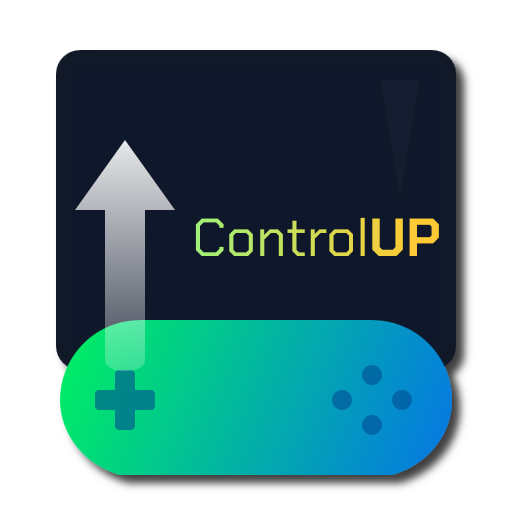

# ControlUp Playnite Extension
<p align="center">
  
</p>

<p align="center">
   
</p>

<p align="center">
  <a href="https://ko-fi.com/Z8Z11SG2IK">
    
  </a>
</p>

## About
A Playnite extension that detects game controller connections and gamepad hotkeys, displaying a customizable popup prompting users to switch to fullscreen mode.

Includes the option to skip the pop-up to let the user directly switch to fullscreen.


*Currently Tested on an Xbox Series X USB/Wireless Controller*

## What's New in 1.0.3

- **Long press hotkey support** - Hold instead of tap for single-button hotkeys like Guide
- **More hotkey combos** - Guide+Start, LB+RB, and single button options
- **Improved fullscreen switching** - Fixed reliability issues with mode transitions. No longer send a simple F11 shortcut :)
- **PlayStation controller support** - Better DualSense/DualShock detection via SDL

See [CHANGELOG.md](CHANGELOG.md) for full details.

## Features

- **Detection Modes**: New connection only, any controller anytime, or startup only
- **Controller Detection Popup**: When a controller is connected, a customizable popup appears asking if you want to switch to fullscreen mode
- **Customizable Pop-up**: Position, size, timing, acrylic blur, colors, and borders, live preview
- **Controller Hotkey**: Trigger fullscreen with button combos (Start+RB, Guide+Start, LB+RB, etc.) or single buttons with long press
- **Controller Navigation**: Navigate the popup with D-pad/thumbsticks, A to confirm, B to cancel


## Installation

1. Download the latest `.pext` file from the [Releases](https://github.com/aHuddini/ControlUp/releases) page
2. Double-click the `.pext` file to install, or drag it into Playnite
3. Restart Playnite when prompted
4. Configure the extension in Settings > Extensions > ControlUp

## Configuration

### General Settings

- **Detection Mode**: When to trigger the fullscreen popup
  - Disabled - No automatic switching
  - New Connection Only - Trigger when controller is newly connected
  - Any Controller Anytime - Trigger on startup and new connections
  - Startup Only - Only check when Playnite starts
- **Skip Popup on Connection**: Switch directly to fullscreen without showing popup
- **Enable Logging**: Turn on detailed logging for troubleshooting

### Hotkey Settings

- **Hotkey Combination**: Choose from many button combos (Start+RB, Guide+Start, LB+RB, etc.) or single buttons
- **Long Press**: Require holding the hotkey instead of instant tap (recommended for single buttons like Guide)
- **Long Press Duration**: How long to hold (300-2000ms)
- **Skip Popup on Hotkey**: Go directly to fullscreen without showing popup
- **Polling Interval**: How often to check for hotkey press (50-100ms recommended)

### Notification Settings

- **Position**: 7 screen positions available
- **Size & Timing**: Adjustable width, height, and auto-close duration
- **Blur Effect**: Acrylic blur with adjustable opacity and tint color
- **Visual Style**: Background, border, and corner radius customization

## Requirements

- Playnite 10 or later
- Windows 10 or later (for acrylic blur effect)
- Xbox, PlayStation, or compatible gamepad


## Development

### Building

1. Clone the repository
2. Open `ControlUp.sln` in Visual Studio
3. Restore NuGet packages
4. Build in Release configuration

### Packaging

Run the packaging script:
```powershell
.\package_extension.ps1
```

The `.pext` file will be created in the `pext` folder.

## License

MIT License - see [LICENSE](LICENSE) file for details

## Troubleshooting

### Fullscreen mode doesn't launch after pressing Yes

If the popup closes but fullscreen mode never appears, **Windows SmartScreen** may be blocking the launch. This happens because ControlUp launches `Playnite.FullscreenApp.exe` as a new process.

**Solution:**
1. Navigate to your Playnite installation folder
2. Right-click on `Playnite.FullscreenApp.exe`
3. Select **Properties**
4. At the bottom of the General tab, if you see "This file came from another computer and might be blocked to help protect this computer", check the **Unblock** checkbox
5. Click **Apply** and **OK**

Alternatively, you can run `Playnite.FullscreenApp.exe` manually once and click "Run anyway" when SmartScreen prompts you.

### Desktop mode closes but nothing happens

Check the Playnite log (`playnite.log`) for errors like "The operation was canceled by the user" - this typically indicates SmartScreen interference (see above).

## Support

If you encounter issues or have suggestions:

1. Enable logging in the extension settings
2. Check the log file in the extension folder (click "Open Extension Folder" in settings)
3. Also check Playnite's main log at `%AppData%\Playnite\playnite.log`
4. Create an issue with detailed information about your setup

## Changelog

See [CHANGELOG.md](CHANGELOG.md) for version history.
