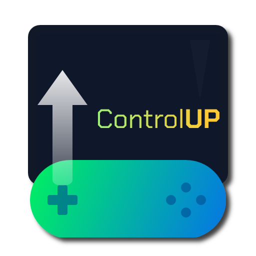

# ControlUp - Playnite Controller Mode Switcher

<p align="center">
  
</p>

<p align="center">
  
  
  
</p>

## About

ControlUp is a Playnite extension that automatically detects game controllers and offers to switch from Desktop mode to Fullscreen mode. Version 2.x leverages Playnite's new **SDL-based controller input system** for reliable cross-platform gamepad support.


**Tested with:** Xbox Series X, PlayStation 5 DualSense, Nintendo Switch Pro Controller, 8BitDo controllers

## Features

- **Smart Controller Detection**: Detects controllers via HID (Xbox, PlayStation, Nintendo, third-party)
- **Controller Hotkeys**: Trigger fullscreen with button combos or single buttons (Guide, Start, Back)
- **Native Controller Navigation**: Navigate popup with D-pad, A to confirm, B to cancel
- **Seamless Mode Switching**: Properly switches to Fullscreen using Playnite's internal mechanism
- **Customizable Popup**: Position, size, timing, acrylic blur, colors, and styling
- **Multiple Trigger Modes**: New connection only, anytime, startup only, or disabled

## Requirements

- **Playnite 11+** with SDL controller support
- **Windows 10/11**
- Enable **"Controller input"** in Playnite Desktop mode settings

## Installation

1. Download the latest `.pext` file from [Releases](https://github.com/yourusername/ControlUp/releases)
2. Double-click the `.pext` file or drag it into Playnite
3. Restart Playnite
4. **Important**: Enable "Controller input" in Playnite Settings > General > Desktop Mode

## Configuration

### Controller Detection Mode

| Mode | Description |
|------|-------------|
| **New Connection Only** (Recommended) | Only triggers on newly connected controllers. Avoids popup when switching back from Fullscreen. |
| **Any Controller Anytime** | Triggers on startup AND monitors for new connections |
| **Startup Only** | Only checks when Playnite starts |
| **Disabled** | No automatic detection |

### Controller Hotkeys

**Combo Hotkeys:** Start+RB, Start+LB, Back+Start, Back+RB, Back+LB

**Single Button Hotkeys:** Guide Button, Start/Options, Back/View/Share

### Notification Customization

Position, size, auto-close duration, acrylic blur, background/border colors, corner radius

## Architecture & Developer Docs

See the [docs/](docs/) folder for technical documentation:

- **[ARCHITECTURE.md](docs/ARCHITECTURE.md)** - How the extension works, component diagrams, mode switching logic
- **[SDK_REFERENCE.md](docs/SDK_REFERENCE.md)** - Playnite SDK controller input API reference

## Development

```powershell
# Build
dotnet build -c Release

# Package
.\package_extension.ps1
```

### Project Structure

```
ControlUp/
├── ControlUp.cs                    # Main plugin, SDK event handlers
├── ControlUpSettings.cs            # Settings model and enums
├── Common/
│   ├── HidControllerDetector.cs    # HID device enumeration
│   ├── XInputWrapper.cs            # XInput connection check
│   └── FileLogger.cs               # Debug logging
├── Views/
│   └── ControllerDetectedDialog.xaml(.cs)
├── ViewModels/
│   └── ControlUpSettingsViewModel.cs
└── docs/                           # Developer documentation
```

## Troubleshooting

1. **Hotkeys not working**: Enable "Controller input" in Playnite Desktop settings
2. **Fullscreen not launching**: Verify `Playnite.FullscreenApp.exe` exists
3. **Controller not detected**: Use "Detect Controllers" in settings
4. **Enable logging**: Check `ControlUp.log` in extension folder

## License

MIT License - see [LICENSE](LICENSE)

## Changelog

See [CHANGELOG.md](CHANGELOG.md)
