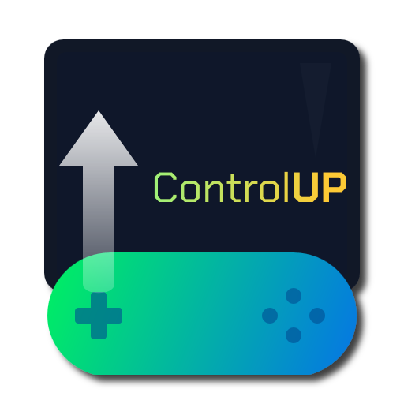

# ControlUp Playnite Extension
<p align="center">
  
</p>

<p align="center">
   
</p>

<p align="center">
  <a href="https://ko-fi.com/Z8Z11SG2IK">
    
  </a>
</p>

## About
A Playnite extension that detects game controller connections and gamepad hotkeys, displaying a customizable popup prompting users to switch to fullscreen mode. Built on Playnite SDK 6.16 and its Controller API for Desktop Mode.

Includes the option to skip the pop-up to let the user directly switch to fullscreen.


*Currently Tested on an Xbox Series X USB/Wireless Controller*

## What's New in 2.5.1

- **No prompt during gameplay** — ControlUp now ignores controller connection events while a game is running, so reconnecting a controller mid-game (waking from sleep, re-pairing) no longer interrupts you with the switch-to-fullscreen prompt. Contributed by [@qoordination](https://github.com/qoordination) ([#5](https://github.com/aHuddini/ControlUp/pull/5)).

Previously in 2.5.0:

- **Playnite SDK 6.16.0** — Updated to the latest SDK (API 6.16.0, Playnite 10.52)
- **Alternative fullscreen switch method** — Opt-in setting that uses Playnite's `--startfullscreen` CLI flag instead of launching `Playnite.FullscreenApp.exe` directly. Enable in Settings → Troubleshooting.
- **Known extension incompatibility** — The [Playnite Overlay](https://github.com/hikaps/playnite-overlay) plugin causes Playnite to crash when ControlUp is installed. See Troubleshooting for details.

See [CHANGELOG.md](CHANGELOG.md) for full version history.

## Features

- **Detection Modes**: New connection only, any controller anytime, or startup only
- **Controller Detection Popup**: Customizable popup when a controller is connected, asking to switch to fullscreen
- **Toast Notifications**: Brief, non-blocking notifications for events like auto-switching
- **Controller Hotkey**: Button combos (Start+RB, Guide+Start, LB+RB, etc.) or single buttons with long press
- **Controller Navigation**: D-pad/thumbsticks to navigate, A to confirm, B to cancel
- **Style Presets**: Quick-apply color schemes for both pop-up and toast notifications
- **Acrylic Blur**: Windows Composition API blur with customizable opacity, tint, and padding
- **Live Preview**: Test appearance from settings before saving

## Installation

1. Download the latest `.pext` file from the [Releases](https://github.com/aHuddini/ControlUp/releases) page
2. Double-click the `.pext` file to install, or drag it into Playnite
3. Restart Playnite when prompted
4. Configure the extension in Settings > Extensions > ControlUp

## Configuration

### General Settings

- **Detection Mode**: When to trigger the fullscreen popup (Disabled, New Connection Only, Any Controller Anytime, Startup Only)
- **Skip Popup on Connection**: Switch directly to fullscreen without showing popup
- **Enable Logging**: Detailed logging for troubleshooting

### Hotkey Settings

- **Hotkey Combination**: Many button combos or single buttons
- **Long Press**: Require holding the hotkey (300-2000ms) — recommended for single buttons like Guide
- **Hotkey Cooldown**: Delay after popup closes before hotkey can trigger again

### Pop-Up Settings

- Style presets, position, size, timing, acrylic blur, background, border with opacity, corner radius, blur padding, vignette effect, and live preview

### Toast Settings

- Style presets (Ocean Teal default), position, size, duration, acrylic blur, border with opacity, accent bar, and colors

## Requirements

- Playnite 10 or later
- Windows 10 or later (for acrylic blur effect)
- Xbox, PlayStation, or compatible gamepad

## Changelog

See [CHANGELOG.md](CHANGELOG.md) for version history.

## Troubleshooting

### Playnite crashes when switching to fullscreen

If Playnite crashes or closes unexpectedly when ControlUp is installed (on controller connect/disconnect or fullscreen switching), this is caused by an **incompatibility with another Playnite extension**. Extensions that hook into window management or overlay rendering can conflict with ControlUp.

**Known incompatible extensions:**
- [Playnite Overlay](https://github.com/hikaps/playnite-overlay) — causes Playnite to crash when ControlUp is installed

**What to do:**
1. Disable the conflicting extension to confirm it's the cause
2. Report the issue to the developers of the incompatible extension
3. You can try the **alternative fullscreen switch method** in Settings → Troubleshooting, but this may not resolve all conflicts

### Fullscreen mode doesn't launch after pressing Yes

If the popup closes but fullscreen mode never appears, **Windows SmartScreen** may be blocking the launch. This happens because ControlUp launches `Playnite.FullscreenApp.exe` as a new process.

**Solution:**
1. Navigate to your Playnite installation folder
2. Right-click on `Playnite.FullscreenApp.exe`
3. Select **Properties**
4. At the bottom of the General tab, if you see "This file came from another computer and might be blocked to help protect this computer", check the **Unblock** checkbox
5. Click **Apply** and **OK**

Alternatively, run `Playnite.FullscreenApp.exe` manually once and click "Run anyway" when SmartScreen prompts.

### Controller shows as "XInput Controller #1"

This is normal and SDL-related — not a bug in ControlUp or Playnite. When using XInput mode, Windows only identifies controllers by slot number and doesn't provide detailed device names. Your controller is working correctly. You can verify this in Playnite's Settings > Input, which shows the same generic names.

## Development

### Building

1. Clone the repository
2. Open `ControlUp.sln` in Visual Studio
3. Restore NuGet packages
4. Build in Release configuration

### Packaging

Run the packaging script:
```powershell
.\package_extension.ps1
```

The `.pext` file will be created in the `pext` folder.

### Libraries & Dependencies
- **Playnite SDK 6.16.0** - Extension framework
- **SDL2** - Controller detection and input mapping (zlib license)
- **MaterialDesignThemes & MaterialDesignColors** - WPF UI components (MIT)
- **Microsoft.Xaml.Behaviors.Wpf** - XAML behaviors (MIT)

### Third-Party Acknowledgments
See [LICENSE](LICENSE) file for component licenses and acknowledgments.

## License

MIT License - see [LICENSE](LICENSE) file for details and third-party acknowledgements
